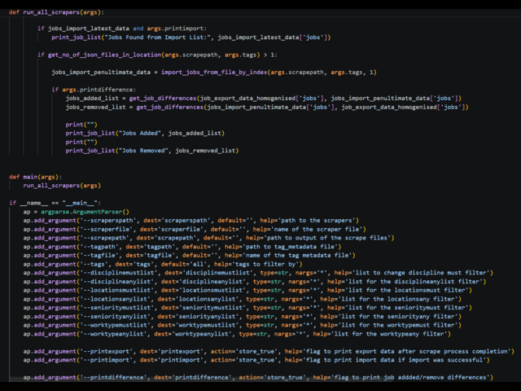
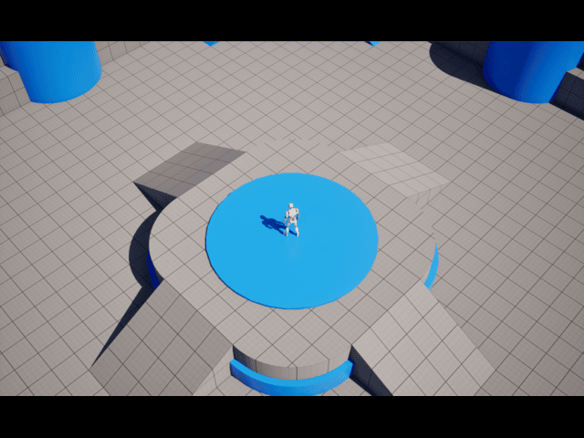

<!-- Full Width Fixed Navigation Bar -->

    
    <!-- Left: Your Name -->
    Richard Spiers
    
    <!-- Center: Navigation Links -->
    

        <a href="#about" style="color: #fff; text-decoration: none; font-size: 0.95rem; font-weight: 500; transition: opacity 0.2s;">About Me</a>
        <a href="#skills" style="color: #fff; text-decoration: none; font-size: 0.95rem; font-weight: 500; transition: opacity 0.2s;">Skills</a>
        <a href="#work" style="color: #fff; text-decoration: none; font-size: 0.95rem; font-weight: 500; transition: opacity 0.2s;">Professional Experience</a>
        <a href="#projects" style="color: #fff; text-decoration: none; font-size: 0.95rem; font-weight: 500; transition: opacity 0.2s;">Personal Projects</a>
        <a href="#game-jams" style="color: #fff; text-decoration: none; font-size: 0.95rem; font-weight: 500; transition: opacity 0.2s;">Game Jams</a>
        <a href="#education" style="color: #fff; text-decoration: none; font-size: 0.95rem; font-weight: 500; transition: opacity 0.2s;">Education</a>
        <a href="#contact" style="color: #fff; text-decoration: none; font-size: 0.95rem; font-weight: 500; transition: opacity 0.2s;">Contact</a>
    

    
    <!-- Right: Icons -->
    

        <!-- LinkedIn Icon Link -->
        <a href="https://linkedin.com/in/richardspiers" target="_blank" style="color: #fff; text-decoration: none; display: flex; align-items: center;">
            <svg height="22" width="22" viewBox="0 0 24 24" fill="currentColor"><path d="M19 0h-14c-2.761 0-5 2.239-5 5v14c0 2.761 2.239 5 5 5h14c2.762 0 5-2.239 5-5v-14c0-2.761-2.238-5-5-5zm-11 19h-3v-11h3v11zm-1.5-12.268c-.966 0-1.75-.79-1.75-1.764s.784-1.764 1.75-1.764 1.75.79 1.75 1.764-.783 1.764-1.75 1.764zm13.5 12.268h-3v-5.604c0-3.368-4-3.113-4 0v5.604h-3v-11h3v1.765c1.396-2.586 7-2.777 7 2.476v6.759z"/></svg>
        </a>
        <!-- Email Icon Link -->
        <a href="mailto:zeterlore@hotmail.com" style="color: #fff; text-decoration: none; display: flex; align-items: center;">
            <svg height="22" width="22" viewBox="0 0 24 24" fill="currentColor"><path d="M0 3v18h24v-18h-24zm21.518 2l-9.518 7.713-9.518-7.713h19.036zm-19.518 14v-11.817l10 8.104 10-8.104v11.817h-20z"/></svg>
        </a>
    

<!-- Full Screen About Me Container (Flushed to Navbar) -->

    
    

        
        <h1 style="font-size: 2.8rem; color: #24292e; margin-top: 0; margin-bottom: 10px; border-bottom: none; font-weight: 700;">Rad Spiers</h1>
        
Senior Systems & Infrastructure Engineer

        
        

            
AAA Software Engineer with over a decade of experience specializing in core engine systems, automated build infrastructure, and performance optimization. Proven track record of delivering stable pipelines and decoupling complex software architectures within high-stakes studio environments.

            
Focused on engineering pragmatism, maintainable systems, and cross-department tool collaboration.

        

    

<!-- Section: Skills -->

    
    <!-- Section Header Title -->
    <h2 style="font-size: 2rem; color: #24292e; text-align: center; margin-bottom: 40px; font-family: -apple-system, BlinkMacSystemFont, 'Segoe UI', Helvetica, Arial, sans-serif; font-weight: 700;">Skills & Expertise</h2>

    <!-- Centered Fluid Grid Container -->
    

        
        <!-- ==================== CARD 1: LANGUAGES ==================== -->
        <!-- Scaled down using width calculations and reduced padding -->
        

            
            <!-- Iconography: Code Brackets </> (Scaled to 36px) -->
            

                <svg viewBox="0 0 24 24" width="36" height="36" stroke="currentColor" stroke-width="2" fill="none" stroke-linecap="round" stroke-linejoin="round">
                    <polyline points="16 18 22 12 16 6"></polyline>
                    <polyline points="8 6 2 12 8 18"></polyline>
                </svg>
            

            
            <!-- Title: Scaled to 1.1rem -->
            <h3 style="font-size: 1.1rem; color: #24292e; margin: 0 0 8px 0; font-weight: 700; font-family: -apple-system, BlinkMacSystemFont, 'Segoe UI', Helvetica, Arial, sans-serif;">Languages</h3>
            
            <!-- Description Text: Scaled to 0.85rem -->
            

                C++, C#, Python, SQL, x86 Assembly
            

        

        <!-- ==================== CARD 2: SYSTEMS ==================== -->
        

            
            <!-- Iconography: Engine / Processor Gear -->
            

                <svg viewBox="0 0 24 24" width="36" height="36" stroke="currentColor" stroke-width="2" fill="none" stroke-linecap="round" stroke-linejoin="round">
                    <circle cx="12" cy="12" r="3"></circle>
                    <path d="M19.4 15a1.65 1.65 0 0 0 .33 1.82l.06.06a2 2 0 1 1-2.83 2.83l-.06-.06a1.65 1.65 0 0 0-1.82-.33 1.65 1.65 0 0 0-1 1.51V21a2 2 0 0 1-4 0v-.09A1.65 1.65 0 0 0 9 19.4a1.65 1.65 0 0 0-1.82.33l-.06.06a2 2 0 1 1-2.83-2.83l.06-.06a1.65 1.65 0 0 0 .33-1.82 1.65 1.65 0 0 0-1.51-1H3a2 2 0 0 1 0-4h.09A1.65 1.65 0 0 0 4.6 9a1.65 1.65 0 0 0-.33-1.82l-.06-.06a2 2 0 1 1 2.83-2.83l.06.06a1.65 1.65 0 0 0 1.82.33H9a1.65 1.65 0 0 0 1-1.51V3a2 2 0 0 1 4 0v.09a1.65 1.65 0 0 0 1 1.51 1.65 1.65 0 0 0 1.82-.33l.06-.06a2 2 0 1 1 2.83 2.83l-.06.06a1.65 1.65 0 0 0-.33 1.82V9a1.65 1.65 0 0 0 1.51 1H21a2 2 0 0 1 0 4h-.09a1.65 1.65 0 0 0-1.51 1z"></path>
                </svg>
            

            
            <h3 style="font-size: 1.1rem; color: #24292e; margin: 0 0 8px 0; font-weight: 700; font-family: -apple-system, BlinkMacSystemFont, 'Segoe UI', Helvetica, Arial, sans-serif;">Core Systems</h3>
            
            

                Unreal Engine runtime, Memory Arenas, Profiling, Decoupling
            

        

        <!-- ==================== CARD 3: INFRASTRUCTURE ==================== -->
        

            
            <!-- Iconography: Server / Pipeline Stack -->
            

                <svg viewBox="0 0 24 24" width="36" height="36" stroke="currentColor" stroke-width="2" fill="none" stroke-linecap="round" stroke-linejoin="round">
                    <line x1="22" y1="12" x2="2" y2="12"></line>
                    <path d="M5.45 5.11L2 12v6a2 2 0 0 0 2 2h16a2 2 0 0 0 2-2v-6l-3.45-6.89A2 2 0 0 0 16.76 4H7.24a2 2 0 0 0-1.79 1.11z"></path>
                    <line x1="6" y1="16" x2="6.01" y2="16"></line>
                    <line x1="10" y1="16" x2="10.01" y2="16"></line>
                </svg>
            

            
            <h3 style="font-size: 1.1rem; color: #24292e; margin: 0 0 8px 0; font-weight: 700; font-family: -apple-system, BlinkMacSystemFont, 'Segoe UI', Helvetica, Arial, sans-serif;">Infrastructure</h3>
            
            

                CI/CD Pipelines, Windows Tools, Automated Builds, Cook Optimization
            

        

        <!-- ==================== CARD 4: COLLABORATION ==================== -->
        

            
            <!-- Iconography: Users / Studio Collaboration -->
            

                <svg viewBox="0 0 24 24" width="36" height="36" stroke="currentColor" stroke-width="2" fill="none" stroke-linecap="round" stroke-linejoin="round">
                    <path d="M17 21v-2a4 4 0 0 0-4-4H5a4 4 0 0 0-4 4v2"></path>
                    <circle cx="9" cy="7" r="4"></circle>
                    <path d="M23 21v-2a4 4 0 0 0-3-3.87"></path>
                    <path d="M16 3.13a4 4 0 0 1 0 7.75"></path>
                </svg>
            

            
            <h3 style="font-size: 1.1rem; color: #24292e; margin: 0 0 8px 0; font-weight: 700; font-family: -apple-system, BlinkMacSystemFont, 'Segoe UI', Helvetica, Arial, sans-serif;">Methodology</h3>
            
            

                Developer Productivity, QA Automation, Cross-Dept Tools, AAA Delivery
            

        

    

<!-- Section: Professional Experience -->

    
    <h2 style="font-size: 2rem; color: #24292e; text-align: center; margin-bottom: 50px; font-weight: 700; border-bottom: none;">Professional Experience</h2>

    

            
        

            

                <iframe 
                    src="https://www.youtube.com/embed/3QHZxzTPsco?rel=0&modestbranding=1" 
                    title="Gameplay Showcase"
                    allow="accelerometer; autoplay; clipboard-write; encrypted-media; gyroscope; picture-in-picture; web-share" 
                    allowfullscreen>
                </iframe>
            

            
            

                <h3 style="font-size: 1.4rem; color: #24292e; margin: 0 0 4px 0; font-weight: 700; border-bottom: none;">Suicide Squad: Kill the Justice League</h3>
                
Automation Engineer | October 2016 - December 2024

                
Rocksteady Studios

                
                <ul style="padding-left: 20px; color: #24292e; font-size: 0.9rem; line-height: 1.6; margin: 0 0 25px 0; flex-grow: 1;">
                    <li>Designed and shipped a complete custom arcade movement system within 48 hours.</li>
                    <li>Optimized particle simulation arrays to maintain 60 FPS overhead boundaries on basic mobile targets.</li>
                    <li>Integrated real-time system tracking data directly using itch.io API frameworks.</li>
                </ul>
                
                

                
                

                    QA
                

            

        

        

            

                <iframe 
                    src="https://www.youtube.com/embed/SwdZvJfxqtE?rel=0&modestbranding=1" 
                    title="Gameplay Showcase"
                    allow="accelerometer; autoplay; clipboard-write; encrypted-media; gyroscope; picture-in-picture; web-share" 
                    allowfullscreen>
                </iframe>
            

            
            

                <h3 style="font-size: 1.4rem; color: #24292e; margin: 0 0 4px 0; font-weight: 700; border-bottom: none;">Batman: Arkham VR</h3>
                
Senior QA for AI | June 2015 - October 2016

                
Rocksteady Studios

                
                <ul style="padding-left: 20px; color: #24292e; font-size: 0.9rem; line-height: 1.6; margin: 0 0 25px 0; flex-grow: 1;">
                    <li>Designed and shipped a complete custom arcade movement system within 48 hours.</li>
                    <li>Optimized particle simulation arrays to maintain 60 FPS overhead boundaries on basic mobile targets.</li>
                    <li>Integrated real-time system tracking data directly using itch.io API frameworks.</li>
                </ul>
                
                

                
                

                    C++
                    Unreal Engine
                    Perforce
                

            

        

        

            

                <iframe 
                    src="https://www.youtube.com/embed/wsf78BS9VE0?rel=0&modestbranding=1" 
                    title="Gameplay Showcase"
                    allow="accelerometer; autoplay; clipboard-write; encrypted-media; gyroscope; picture-in-picture; web-share" 
                    allowfullscreen>
                </iframe>
            

            
            

                <h3 style="font-size: 1.4rem; color: #24292e; margin: 0 0 4px 0; font-weight: 700; border-bottom: none;">Batman: Arkham Knight</h3>
                
QA for AI | April 2014 - June 2015

                
Rocksteady Studios

                
                <ul style="padding-left: 20px; color: #24292e; font-size: 0.9rem; line-height: 1.6; margin: 0 0 25px 0; flex-grow: 1;">
                    <li>Designed and shipped a complete custom arcade movement system within 48 hours.</li>
                    <li>Optimized particle simulation arrays to maintain 60 FPS overhead boundaries on basic mobile targets.</li>
                    <li>Integrated real-time system tracking data directly using itch.io API frameworks.</li>
                </ul>
                
                

                
                

                    C++
                    Unreal Engine
                    Perforce
                

            

        

        

            

                <iframe 
                    src="https://www.youtube.com/embed/IjvKWtefU9c?rel=0&modestbranding=1" 
                    title="Gameplay Showcase"
                    allow="accelerometer; autoplay; clipboard-write; encrypted-media; gyroscope; picture-in-picture; web-share" 
                    allowfullscreen>
                </iframe>
            

            
            

                <h3 style="font-size: 1.4rem; color: #24292e; margin: 0 0 4px 0; font-weight: 700; border-bottom: none;">Strike Suit Zero: Director's Cut</h3>
                
Senior Compliance QA | December 2013 - March 2013

                
Born Ready Games

                
                <ul style="padding-left: 20px; color: #24292e; font-size: 0.9rem; line-height: 1.6; margin: 0 0 25px 0; flex-grow: 1;">
                    <li>Designed and shipped a complete custom arcade movement system within 48 hours.</li>
                    <li>Optimized particle simulation arrays to maintain 60 FPS overhead boundaries on basic mobile targets.</li>
                    <li>Integrated real-time system tracking data directly using itch.io API frameworks.</li>
                </ul>
                
                

                
                

                    C++
                    Unreal Engine
                    Perforce
                

            

        

        

            

                <iframe 
                    src="https://www.youtube.com/embed/APMrtUd4WW8?rel=0&modestbranding=1" 
                    title="Gameplay Showcase"
                    allow="accelerometer; autoplay; clipboard-write; encrypted-media; gyroscope; picture-in-picture; web-share" 
                    allowfullscreen>
                </iframe>
            

            
            

                <h3 style="font-size: 1.4rem; color: #24292e; margin: 0 0 4px 0; font-weight: 700; border-bottom: none;">FIFA 14</h3>
                
Authenticity QA | October 2012 - December 2013

                
Electronic Arts Canada

                
                <ul style="padding-left: 20px; color: #24292e; font-size: 0.9rem; line-height: 1.6; margin: 0 0 25px 0; flex-grow: 1;">
                    <li>Designed and shipped a complete custom arcade movement system within 48 hours.</li>
                    <li>Optimized particle simulation arrays to maintain 60 FPS overhead boundaries on basic mobile targets.</li>
                    <li>Integrated real-time system tracking data directly using itch.io API frameworks.</li>
                </ul>
                
                

                
                

                    C++
                    Unreal Engine
                

            

        

        

            

                <iframe 
                    src="https://www.youtube.com/embed/Ia43OgdBHaE?rel=0&modestbranding=1" 
                    title="Gameplay Showcase"
                    allow="accelerometer; autoplay; clipboard-write; encrypted-media; gyroscope; picture-in-picture; web-share" 
                    allowfullscreen>
                </iframe>
            

            
            

                <h3 style="font-size: 1.4rem; color: #24292e; margin: 0 0 4px 0; font-weight: 700; border-bottom: none;">FIFA 13</h3>
                
Authenticity QA | October 2011 - September 2012

                
Electronic Arts Canada

                
                <ul style="padding-left: 20px; color: #24292e; font-size: 0.9rem; line-height: 1.6; margin: 0 0 25px 0; flex-grow: 1;">
                    <li>Designed and shipped a complete custom arcade movement system within 48 hours.</li>
                    <li>Optimized particle simulation arrays to maintain 60 FPS overhead boundaries on basic mobile targets.</li>
                    <li>Integrated real-time system tracking data directly using itch.io API frameworks.</li>
                </ul>
                
                

                
                

                    C++
                    Unreal Engine
                

            

        

        

            

                <iframe 
                    src="https://www.youtube.com/embed/An-E0GOKwvA?rel=0&modestbranding=1" 
                    title="Gameplay Showcase"
                    allow="accelerometer; autoplay; clipboard-write; encrypted-media; gyroscope; picture-in-picture; web-share" 
                    allowfullscreen>
                </iframe>
            

            
            

                <h3 style="font-size: 1.4rem; color: #24292e; margin: 0 0 4px 0; font-weight: 700; border-bottom: none;">FIFA 12</h3>
                
Authenticity QA | April 2011 - September 2011

                
Electronic Arts Canada

                
                <ul style="padding-left: 20px; color: #24292e; font-size: 0.9rem; line-height: 1.6; margin: 0 0 25px 0; flex-grow: 1;">
                    <li>Designed and shipped a complete custom arcade movement system within 48 hours.</li>
                    <li>Optimized particle simulation arrays to maintain 60 FPS overhead boundaries on basic mobile targets.</li>
                    <li>Integrated real-time system tracking data directly using itch.io API frameworks.</li>
                </ul>
                
                

                
                

                    C++
                    Unreal Engine
                

            

        

        

            

                <iframe 
                    src="https://www.youtube.com/embed/BvuIHSEX6x8?rel=0&modestbranding=1" 
                    title="Gameplay Showcase"
                    allow="accelerometer; autoplay; clipboard-write; encrypted-media; gyroscope; picture-in-picture; web-share" 
                    allowfullscreen>
                </iframe>
            

            
            

                <h3 style="font-size: 1.4rem; color: #24292e; margin: 0 0 4px 0; font-weight: 700; border-bottom: none;">Fable III</h3>
                
Quality Assurance | February 2010 - April 2011

                
Lionhead Studios

                
                <ul style="padding-left: 20px; color: #24292e; font-size: 0.9rem; line-height: 1.6; margin: 0 0 25px 0; flex-grow: 1;">
                    <li>Designed and shipped a complete custom arcade movement system within 48 hours.</li>
                    <li>Optimized particle simulation arrays to maintain 60 FPS overhead boundaries on basic mobile targets.</li>
                    <li>Integrated real-time system tracking data directly using itch.io API frameworks.</li>
                </ul>
                
                

                
                

                    C++
                    Unreal Engine
                

            

        

        
    

<!-- Section: Personal Projects Entries -->

    
    <h2 style="font-size: 2rem; color: #24292e; text-align: center; margin-bottom: 50px; font-family: -apple-system, BlinkMacSystemFont, 'Segoe UI', Helvetica, Arial, sans-serif; font-weight: 700;">Personal Projects</h2>

    

        
        

            

                
            

            
            

                
                <h3 style="font-size: 1.35rem; color: #24292e; margin: 0 0 4px 0; font-weight: 700; line-height: 1.3;">Project Title Alpha</h3>
                
                2026
                
                

                    A core software architecture system designed to handle high-throughput telemetry data processing. Implemented an optimized memory arena allocator to reduce allocation overhead during intensive runtime ticks.
                

                
                

                    C++
                    Systems
                    Optimization
                

                
            

        

        

            

                
            

            
            

                <h3 style="font-size: 1.35rem; color: #24292e; margin: 0 0 4px 0; font-weight: 700; line-height: 1.3;">Project Title Beta</h3>
                2025
                
                

                    Custom built CI/CD build distribution pipeline designed for rapid multi-platform deployment targets. Decoupled asset cooking processes from standard engine execution paths to stabilize development iteration cycles.
                

                
                

                    Python
                    Infrastructure
                    CI/CD
                

            

        

        

<!-- Section: Game Jams -->

    
    <h2 style="font-size: 2rem; color: #24292e; text-align: center; margin-bottom: 50px; font-weight: 700; border-bottom: none;">Game Jams</h2>

    

            
        

            

                <iframe 
                    src="https://www.youtube.com/embed/aYPwhwf2uF8?rel=0&modestbranding=1" 
                    title="Gameplay Showcase"
                    allow="accelerometer; autoplay; clipboard-write; encrypted-media; gyroscope; picture-in-picture; web-share" 
                    allowfullscreen>
                </iframe>
            

            
            

                <h3 style="font-size: 1.4rem; color: #24292e; margin: 0 0 4px 0; font-weight: 700; border-bottom: none;">Shift Happens</h3>
                
Gameplay Programmer | October 2025

                
Minigame Rumble

                
                <ul style="padding-left: 20px; color: #24292e; font-size: 0.9rem; line-height: 1.6; margin: 0 0 25px 0; flex-grow: 1;">
                    <li>Designed and shipped a complete custom arcade movement system within 48 hours.</li>
                    <li>Optimized particle simulation arrays to maintain 60 FPS overhead boundaries on basic mobile targets.</li>
                    <li>Integrated real-time system tracking data directly using itch.io API frameworks.</li>
                </ul>
                
                

                
                

                    C++
                    Unreal Engine
                    Perforce
                

            

        

        

            

                <iframe 
                    src="https://www.youtube.com/embed/Ruh11qRzqdg?rel=0&modestbranding=1"
                    title="Gameplay Showcase"
                    allow="accelerometer; autoplay; clipboard-write; encrypted-media; gyroscope; picture-in-picture; web-share" 
                    allowfullscreen>
                </iframe>
            

            
            

                <h3 style="font-size: 1.4rem; color: #24292e; margin: 0 0 4px 0; font-weight: 700; border-bottom: none;">Outdated</h3>
                
Generalist Programmer | September 2023

                
Third Person Puzzle Game

                
                <ul style="padding-left: 20px; color: #24292e; font-size: 0.9rem; line-height: 1.6; margin: 0 0 25px 0; flex-grow: 1;">
                    <li>Designed and shipped a complete custom arcade movement system within 48 hours.</li>
                    <li>Optimized particle simulation arrays to maintain 60 FPS overhead boundaries on basic mobile targets.</li>
                    <li>Integrated real-time system tracking data directly using itch.io API frameworks.</li>
                </ul>
                
                

                
                

                    C++
                    Unreal Engine
                    Perforce
                

            

        

        

            

                <iframe 
                    src="https://www.youtube.com/embed/ZNAHgOnTopw?rel=0&modestbranding=1" 
                    title="Gameplay Showcase"
                    allow="accelerometer; autoplay; clipboard-write; encrypted-media; gyroscope; picture-in-picture; web-share" 
                    allowfullscreen>
                </iframe>
            

            
            

                <h3 style="font-size: 1.4rem; color: #24292e; margin: 0 0 4px 0; font-weight: 700; border-bottom: none;">The Banquet Below</h3>
                
Generalist Programmer | September 2022

                
FPS Mystery Puzzle Game

                
                <ul style="padding-left: 20px; color: #24292e; font-size: 0.9rem; line-height: 1.6; margin: 0 0 25px 0; flex-grow: 1;">
                    <li>Designed and shipped a complete custom arcade movement system within 48 hours.</li>
                    <li>Optimized particle simulation arrays to maintain 60 FPS overhead boundaries on basic mobile targets.</li>
                    <li>Integrated real-time system tracking data directly using itch.io API frameworks.</li>
                </ul>
                
                

                
                

                    C++
                    Unreal Engine
                    Perforce
                

            

        

        

            

                <iframe 
                    src="https://www.youtube.com/embed/MQhBs2qRt4c?rel=0&modestbranding=1"
                    title="Gameplay Showcase"
                    allow="accelerometer; autoplay; clipboard-write; encrypted-media; gyroscope; picture-in-picture; web-share" 
                    allowfullscreen>
                </iframe>
            

            
            

                <h3 style="font-size: 1.4rem; color: #24292e; margin: 0 0 4px 0; font-weight: 700; border-bottom: none;">Malware</h3>
                
Generalist Programmer | September 2021

                
2D Puzzle Platformer

                
                <ul style="padding-left: 20px; color: #24292e; font-size: 0.9rem; line-height: 1.6; margin: 0 0 25px 0; flex-grow: 1;">
                    <li>Designed and shipped a complete custom arcade movement system within 48 hours.</li>
                    <li>Optimized particle simulation arrays to maintain 60 FPS overhead boundaries on basic mobile targets.</li>
                    <li>Integrated real-time system tracking data directly using itch.io API frameworks.</li>
                </ul>
                
                

                
                

                    C++
                    Unreal Engine
                    Perforce
                

            

        

        

            

                <iframe 
                    src="https://www.youtube.com/embed/y_-oG3KM9LY?rel=0&modestbranding=1" 
                    title="Gameplay Showcase"
                    allow="accelerometer; autoplay; clipboard-write; encrypted-media; gyroscope; picture-in-picture; web-share" 
                    allowfullscreen>
                </iframe>
            

            
            

                <h3 style="font-size: 1.4rem; color: #24292e; margin: 0 0 4px 0; font-weight: 700; border-bottom: none;">Time Janitors</h3>
                
Generalist Programmer | September 2020

                
FPS Time Travel Puzzle Adventure

                
                <ul style="padding-left: 20px; color: #24292e; font-size: 0.9rem; line-height: 1.6; margin: 0 0 25px 0; flex-grow: 1;">
                    <li>Designed and shipped a complete custom arcade movement system within 48 hours.</li>
                    <li>Optimized particle simulation arrays to maintain 60 FPS overhead boundaries on basic mobile targets.</li>
                    <li>Integrated real-time system tracking data directly using itch.io API frameworks.</li>
                </ul>
                
                

                
                

                    C++
                    Unreal Engine
                

            

        

        
    

<!-- Section: Education -->

    
    <h2 style="font-size: 2rem; color: #24292e; text-align: center; margin-bottom: 40px; font-weight: 700; border-bottom: none;">Education</h2>
    
    <!-- Education Grid Row -->
    

        
        <!-- Degree Card 1 -->
        <a href="https://www.beds.ac.uk" target="_blank" class="edu-card">
            

                
                

                    <svg height="45" width="45" viewBox="0 0 24 24" fill="none" stroke="currentColor" stroke-width="2" stroke-linecap="round" stroke-linejoin="round"><path d="M22 10v6M2 10l10-5 10 5-10 5z"/><path d="M6 12v5c0 2 2 3 6 3s6-1 6-3v-5"/></svg>
                

                
                <h3 style="font-size: 1.25rem; color: #24292e; margin: 0 0 4px 0; font-weight: 700; line-height: 1.3;">Artifical Intelligence & Robotics (BSc)</h3>
                
                University of Bedfordshire
                
                2003 — 2006
            

            
Visit Institution

        </a>

    

    
    <h2 style="font-size: 2rem; color: #24292e; text-align: center; margin-bottom: 40px; font-weight: 700; border-bottom: none;">Get In Touch</h2>
    
    

        
        <a href="https://linkedin.com/in/richardspiers" target="_blank" class="contact-card">
            

                

                    <svg height="40" width="40" viewBox="0 0 24 24" fill="currentColor"><path d="M19 0h-14c-2.761 0-5 2.239-5 5v14c0 2.761 2.239 5 5 5h14c2.762 0 5-2.239 5-5v-14c0-2.761-2.238-5-5-5zm-11 19h-3v-11h3v11zm-1.5-12.268c-.966 0-1.75-.79-1.75-1.764s.784-1.764 1.75-1.764 1.75.79 1.75 1.764-.783 1.764-1.75 1.764zm13.5 12.268h-3v-5.604c0-3.368-4-3.113-4 0v5.604h-3v-11h3v1.765c1.396-2.586 7-2.777 7 2.476v6.759z"/></svg>
                

                <h3 style="font-size: 1.3rem; color: #24292e; margin: 0 0 10px 0; font-weight: 600;">LinkedIn</h3>
                
Let's connect professionally.

            

            
View Profile

        </a>

        <a href="mailto:your.zeterlore@hotmail.com" class="contact-card">
            

                

                    <svg height="40" width="40" viewBox="0 0 24 24" fill="currentColor"><path d="M0 3v18h24v-18h-24zm21.518 2l-9.518 7.713-9.518-7.713h19.036zm-19.518 14v-11.817l10 8.104 10-8.104v11.817h-20z"/></svg>
                

                <h3 style="font-size: 1.3rem; color: #24292e; margin: 0 0 10px 0; font-weight: 600;">Email</h3>
                
Send a message directly to my inbox.

            

            
Send Message

        </a>

        <a href="https://radsy.itch.io" target="_blank" class="contact-card">
            

                

                    <svg height="40" width="40" viewBox="0 0 24 24" fill="currentColor"><path d="M3.522 4.417c-.772.046-1.464.444-1.87 1.096-.407.652-.486 1.453-.217 2.168l1.451 3.86c-1.127.42-1.884 1.507-1.886 2.715v4.51c.002 1.782 1.445 3.223 3.227 3.224h15.546c1.782-.001 3.225-1.442 3.227-3.224v-4.51c-.002-1.208-.759-2.295-1.886-2.715l1.451-3.86c.269-.715.19-1.516-.217-2.168-.406-.652-1.098-1.05-1.87-1.096zm.224 1.76h16.508c.241.014.457.139.584.343.128.204.153.454.068.68l-1.353 3.593c-.097.256-.343.424-.617.424h-13.872c-.274 0-.52-.168-.617-.424l-1.353-3.593c-.085-.226-.06-.476.068-.68.127-.204.343-.329.584-.343zm1.613 6.945c.42-.002.82.165 1.116.463l1.523 1.53 1.525-1.53c.594-.6 1.637-.6 2.23 0l1.525 1.53 1.524-1.53c.594-.6 1.637-.6 2.231 0l1.524 1.53 1.524-1.53c.63-.615 1.698-.573 2.278.09l.487.558c.267.306.413.698.412 1.103v2.856c0 .414-.336.75-.75.75s-.75-.336-.75-.75v-2.394l-.736-.843c-.144-.165-.41-.165-.554 0l-1.764 1.77c-.594.6-1.636.6-2.23 0l-1.524-1.53-1.524 1.53c-.594.6-1.637.6-2.23 0l-1.525-1.53-1.524 1.53c-.594.6-1.637.6-2.23 0l-1.765-1.77c-.143-.165-.409-.165-.553 0l-.736.843v2.394c0 .414-.336.75-.75.75s-.75-.336-.75-.75v-2.856c0-.405.146-.797.412-1.103l.488-.558c.28-.32.682-.501 1.105-.494z"/></svg>
                

                <h3 style="font-size: 1.3rem; color: #24292e; margin: 0 0 10px 0; font-weight: 600;">itch.io</h3>
                
Play the games I contributed to in the Epic MegaJam.

            

            
MegaJam Entries

        </a>

    

<!-- Custom Professional Footer -->
<footer style="padding: 40px 0 20px 0; text-align: center; font-family: -apple-system, BlinkMacSystemFont, 'Segoe UI', Helvetica, Arial, sans-serif; font-size: 0.9rem; color: #586069;">
    
© 2026 Richard Spiers. All rights reserved.

</footer>
